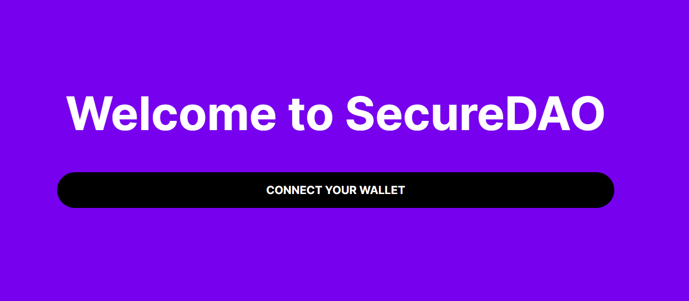
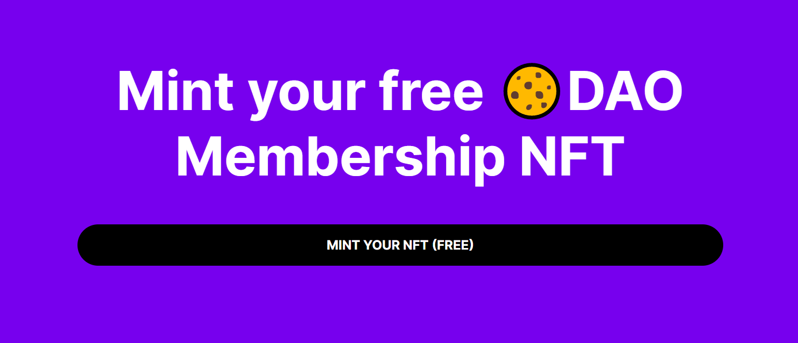
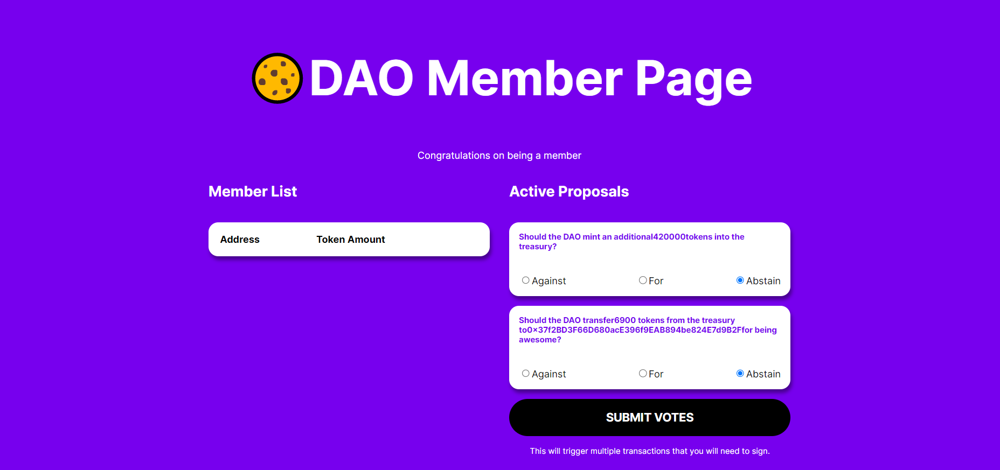

# Thirdweb - Build your own DAO with just Javascript

This repo contains coursework project from [buildspace](https://buildspace.so/) completed by [0xsenzel](https://github.com/0xSenzel/) for [Create your own DAO](https://buildspace.so/builds) lesson.

## Project Info

Build a dapp that lets people connect their wallet, get an NFT, see a DAO Dashboard where they can see other members + actually vote on proposals that are executed directly by your governance contract using [thirdweb](https://thirdweb.com/) sdk.

## Project Demo

<figure>

<p align="center">Fig.1 - Home Page</p>
</figure>

<br/>

<figure>

<p align="center">Fig.2 - Connected with wallet</p>
</figure>

<br/>

<figure>

<p align="center">Fig.3 - NFT holder's login page</p>
</figure>

<br/>

## Project Setup

### React Js

Head to [my-app](./my-app/) folder:

```
npm install
```

- Add `.env` file inside root folder:

```
PRIVATE_KEY= YOUR_WALLET_PRIVATE_KEY
WALLET_ADDRESS= YOUR_WALLET_ADDRESS
ALCHEMY_API_URL= YOUR_ETHEREUM_API
```

- Deploy all the js file inside [scripts](./scripts/) folder:

```
node scripts/<FILE_NAME>
// eg: node scripts/1-initialize-sdk.js
```

- To run the app locally :

```
npm start
```
